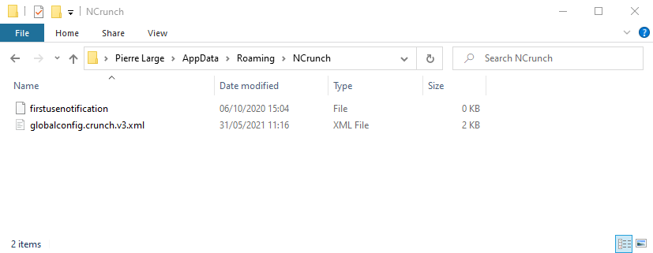

# NCrunch configuration

The **ncrunch-configuration** folder contains the export of the global NCrunch configuration.

This page describes how to proceed.

## Table of contents

- [Foreword](#Foreword)
- [Exporting global configuration](#Exporting-global-configuration)
- [Importing global configuration](#Importing-global-configuration)
- [Reference](#Reference)

- - -

## Foreword

NCrunch uses a hierarchical configuration system, as described in the [documentation](https://www.ncrunch.net/documentation/concepts_advanced-configuration).  
Solution and project configurations should be stored in a VCS, as part of the source code.

Only the global configuration will be discussed in the following.

## Exporting global configuration

Close all opened `Visual Studio` instances.

In `Windows Explorer`, go to `%APPDATA%\NCrunch`

Copy the `globalconfig.crunch.v3.xml` file in your local git repository.

## Importing global configuration

Close all opened `Visual Studio` instances.

In `Windows Explorer`, go to `%APPDATA%\NCrunch`

Replace the `globalconfig.crunch.v3.xml` file with the stored file in the git repository.

## Reference

[Global configuration documentation](https://www.ncrunch.net/documentation/reference_global-configuration_overview)

[Advanced configuration](https://www.ncrunch.net/documentation/concepts_advanced-configuration)
