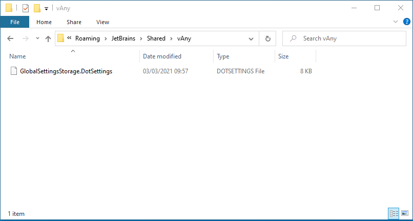

# ReSharper configuration

The **resharper-configuration** folder contains the export of the global ReSharper configuration.

This page describes how to proceed.

## Table of contents

- [Foreword](#Foreword)
- [Exporting global settings](#Exporting-global-settings)
- [Importing global settings](#Importing-global-settings)
- [Reference](#Reference)

- - -

## Foreword

ReSharper uses a hierarchical configuration system, as described in the [documentation](https://www.jetbrains.com/help/resharper/Sharing_Configuration_Options.html#layers).  
Solution and project settings should be stored in a VCS, as part of the source code.

Only the global configuration will be discussed in the following.

## Exporting global settings

Close all opened `Visual Studio` instances.

In `Windows Explorer`, go to `%APPDATA%\JetBrains\Shared\vAny`

Copy the `GlobalSettingsStorage.DotSettings` file in this git repository.

## Importing global settings

Close all opened `Visual Studio` instances.

In `Windows Explorer`, go to `%APPDATA%\JetBrains\Shared\vAny`

Replace the `GlobalSettingsStorage.DotSettings` file with the stored file in the git repository.

## Reference

[Manage and share ReSharper settings](https://www.jetbrains.com/help/resharper/Sharing_Configuration_Options.html)
