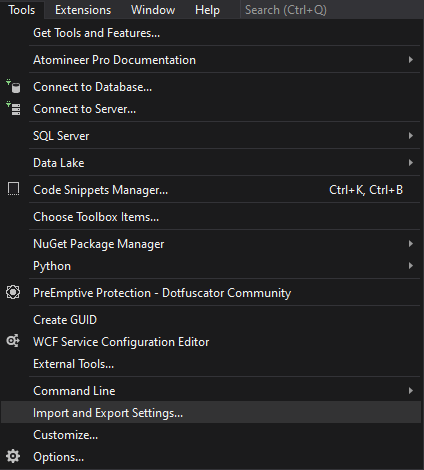
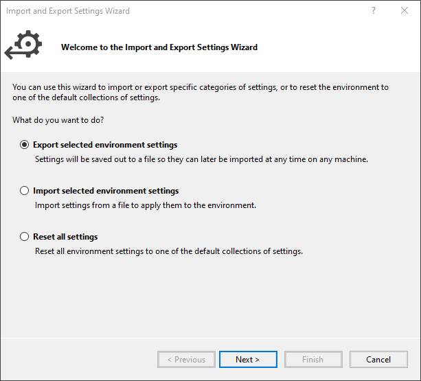
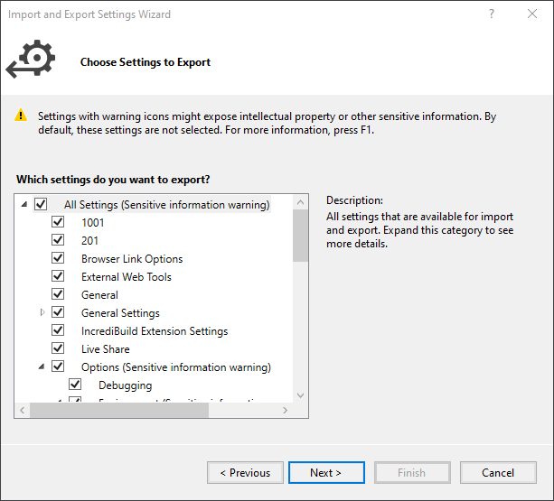
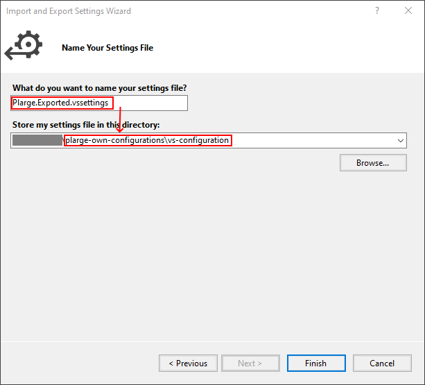
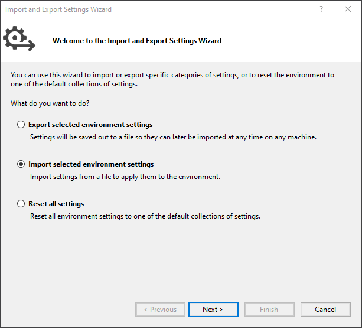
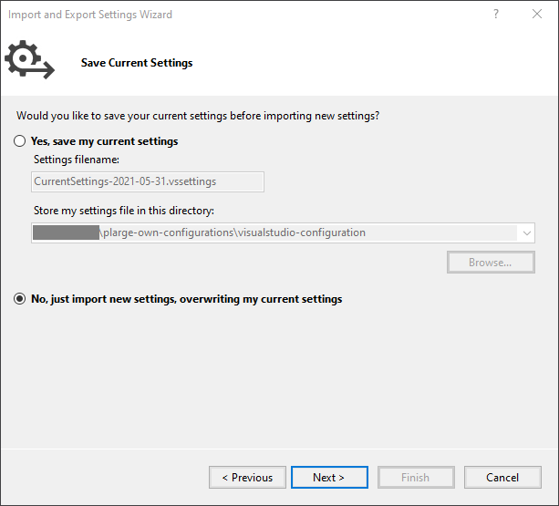
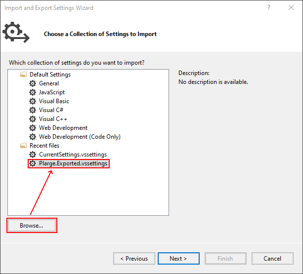
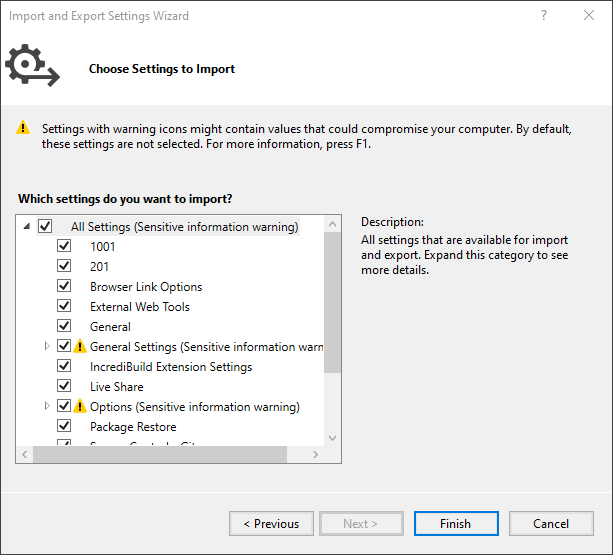

# Visual Studio configuration

The **vs-configuration** folder contains the exported settings from Visual Studio.

This page describes how to export or import settings.

## Table of contents

- [Exporting Visual Studio settings](#Exporting-Visual-Studio-settings)
- [Importing Visual Studio settings](#Importing-Visual-Studio-settings)

- - -

## Exporting Visual Studio settings

Click `Tools` -> `Import and Export Settings...`

In the `Import and Export Setting Wizard`, select `Export selected environment settings`, and then click `Next`.

Select `All Settings`, and click `Next`.

Set the file name and the directory to store the settings in this git repository, and click `Finish`.

## Importing Visual Studio settings

Click `Tools` -> `Import and Export Settings...`

In the `Import and Export Setting Wizard`, select `Import selected environment settings`, and then click `Next`.

Select `No, just import new settings, overwritting my current settings`, and clieck `Next`

Click `Browse...`, select the saved __`.vssettings`__ file and then click `Next`.

Select `All Settings`, and click `Finish`.

